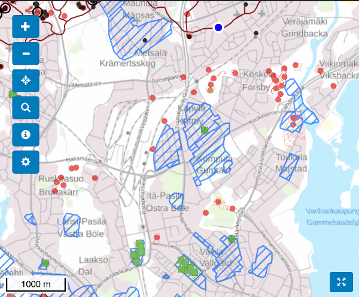
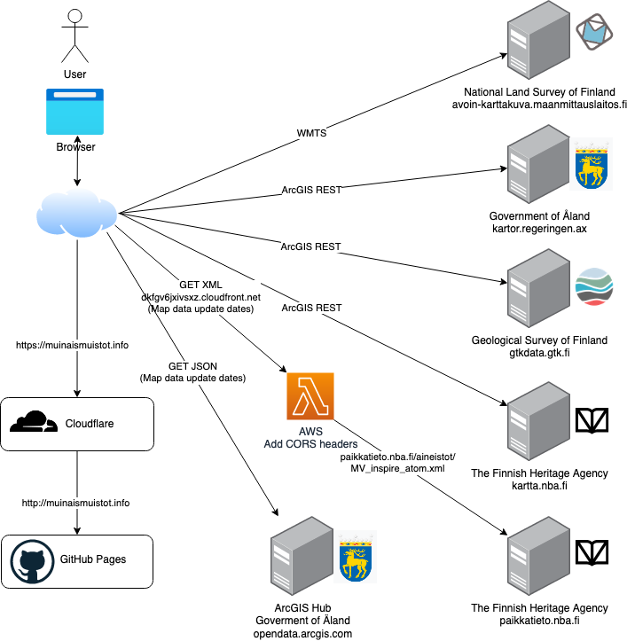

# Muinaismuistot.info

A web page to show ancient monuments of Finland in mobile friendly map.

## Technologies

- UI
  - [TypeScript](https://www.typescriptlang.org/)
  - [OpenLayers](https://openlayers.org/)
  - [React](https://reactjs.org/)
  - [Redux](https://redux.js.org/)
  - [Redux Observable](https://redux-observable.js.org/)
  - [RxJS](https://rxjs.dev/)
  - [Bootstrap](https://getbootstrap.com/docs/3.3/)
  - [React i18next](https://react.i18next.com/)
- Build
  - [Node.js](https://nodejs.org/en/)
  - [Webpack](https://webpack.js.org/)
- Infrastucture
  - [GitHub pages](https://pages.github.com/)
  - [Cloudflare](https://www.cloudflare.com)
  - [AWS Lambda](https://aws.amazon.com/lambda/)

## Infrastructure

The whole UI is just static `html` and `js` files from Webpack build that are hosted in [GitHub pages](https://pages.github.com/) of this repository: [https://anttikekki.github.io/muinaismuistot](https://anttikekki.github.io/muinaismuistot). [Cloudflare](https://www.cloudflare.com) is used as a reverse proxy to add HTTPS support.

There is no hosted backend server. Browser calls directly data providers map servers to fetch map tile images and data. One [AWS Lambda](https://aws.amazon.com/lambda/) is used as reverse proxy to add [CORS headers](https://en.wikipedia.org/wiki/Cross-origin_resource_sharing#Headers) to request to [http://paikkatieto.nba.fi/aineistot/MV_inspire_atom.xml](http://paikkatieto.nba.fi/aineistot/MV_inspire_atom.xml) so that UI in browser can acces it from different domain.

## Development environment

### Requirements

- [Node.js](https://nodejs.org/en/) 12 or 14 or later installed
- Only MacOS is tested, Linux should also work. `package.json`scripts use `PARAM=value` type parameters that require different syntax on Windows.

### Environment setup

1. Install Node.js
2. Clone this repository
3. Run `npm install`

### Commands

### `npm run dev`

Runs UI locally with [webpack dev server](https://webpack.js.org/configuration/dev-server/). Opens system default browser to [https://localhost:8091](https://localhost:8091). The UI refreshes automatically after code changes.

### `npm run prod`

Same as `npm run dev` but uses production build with code minication.

### `npm run build:dev`

Builds development version of the UI with webpack to `./dist` folder without code minification and with Redux dev tools support.

### `npm run build:prod`

Builds production version of the UI with webpack to `./dist` folder with code minification and without Redux dev tools support.

### `npm run profile-size`

Runs [webpack bundle analyzer](https://github.com/webpack-contrib/webpack-bundle-analyzer) and opens it's UI to system default browser. Handy tool to analyze what libraries are included in the final build result.
